# MagicCube
This is a program used to identify and solve the Rubik's Cube.

## Background
The purpose of this project itself is to understand and learn the process of program development, and at the same time learn the corresponding programming and engineering knowledge.

The goal of this program is to collect real-world Rubik's Cube information and reproduce it in the program based on this information, then restore it and visualize the process.

## Platform
Windows

## Install
Clone this repository to local.

```
$ git clone https://github.com/2820207922/MagicCube.git
```

Run the following code to install dependencies. It is recommended to use Conda to create a virtual environment before.

```
$ pip install -r requirements
```

## Usage
Find the file ```visualization.py``` and run it. Wait for a while, you will see the following screen.

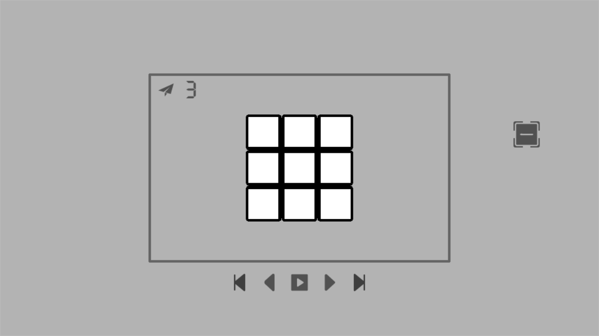

Click the button on the far right. you will see 

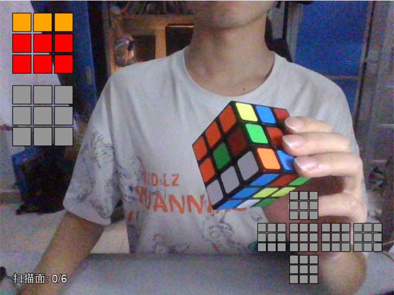

Aim the Rubik's Cube at the camera, and press the space to complete a capture.

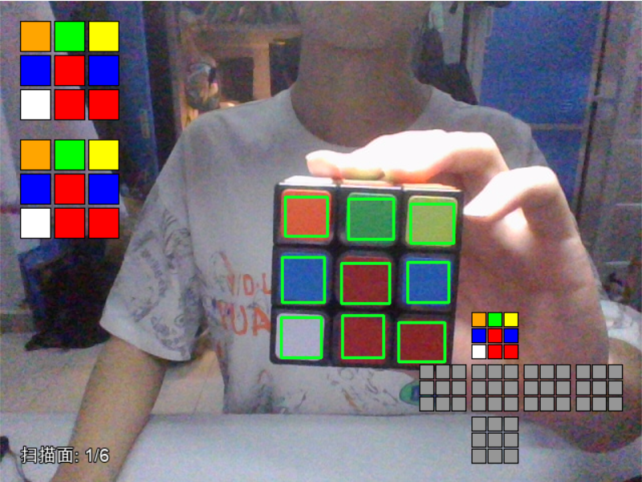

If you find that the color is not accurate when capturing, press c to enter the correction mode, and then correct in turn.

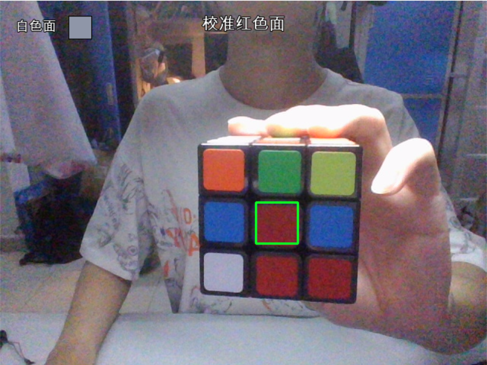

Then capture 6 faces in turn, make sure each face is correct.

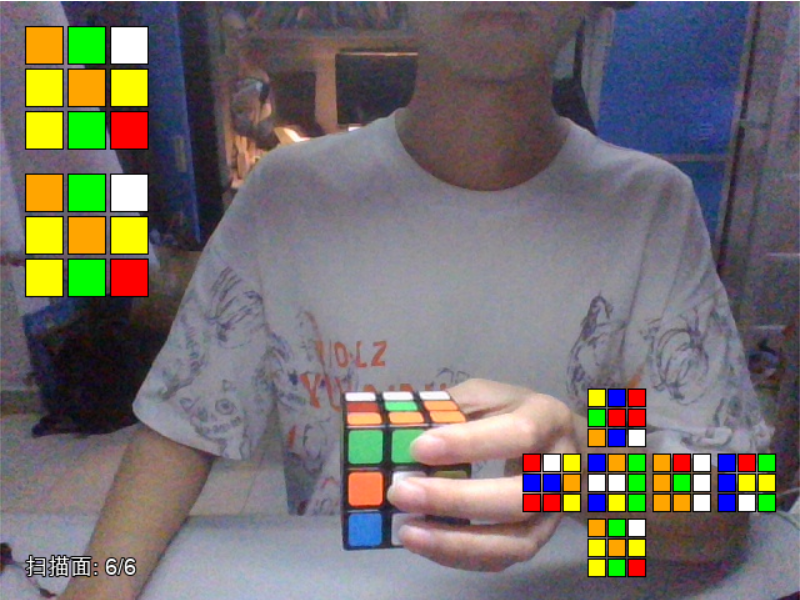

Press the enter key to automatically complete the homing of each surface.

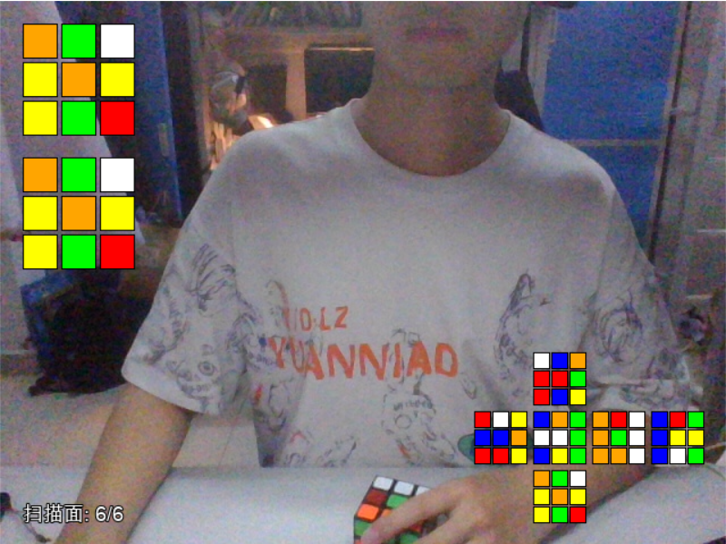

Press esc to exit, after completing the above steps you will find that your Rubik's Cube has been copied. Clicking the play button will start the restore.

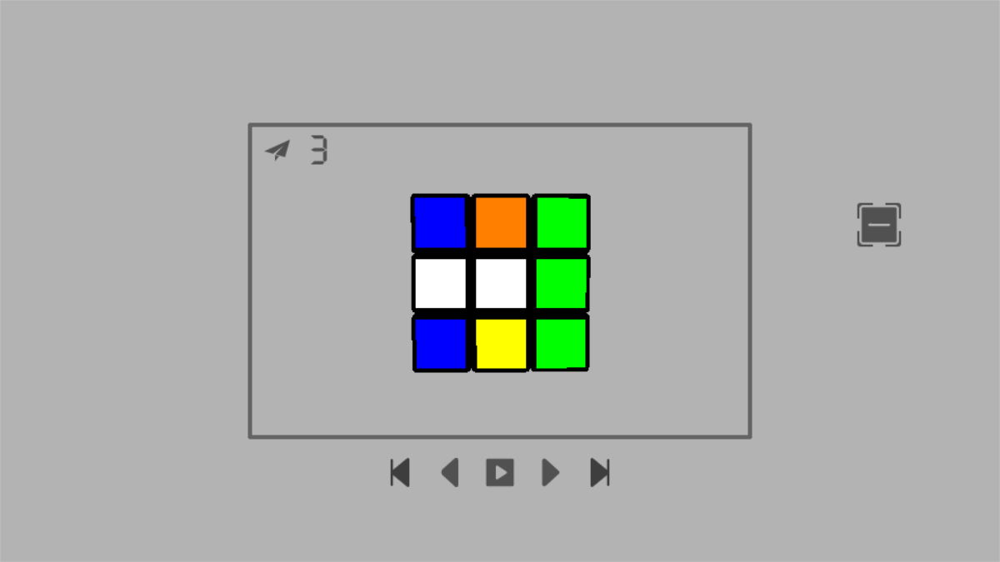
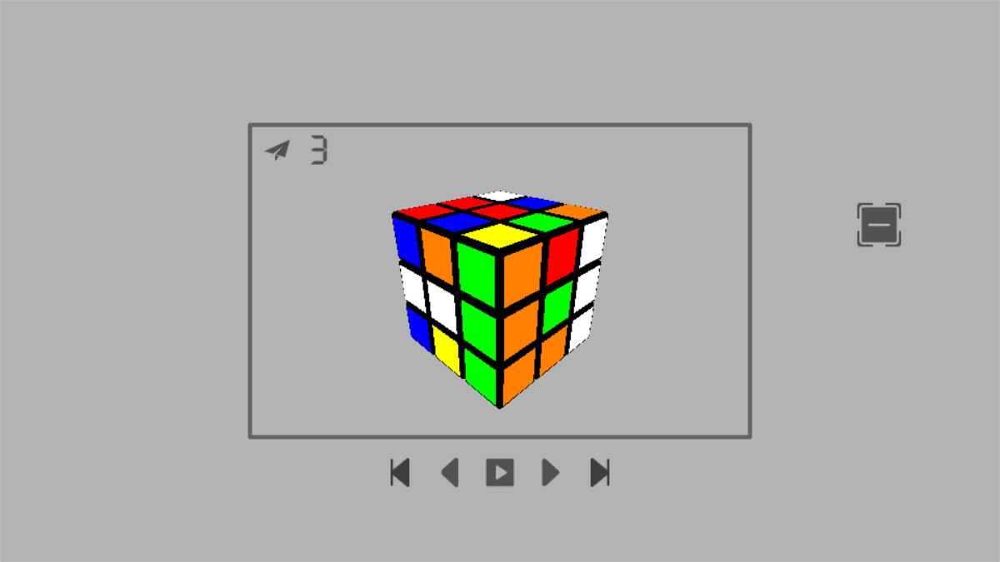
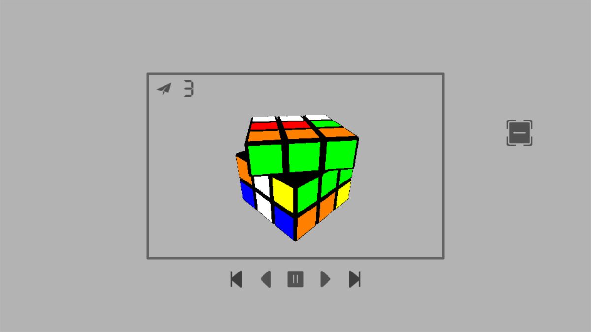

Finally, your Rubik's Cube will be solved. You can check more functions in the image below.

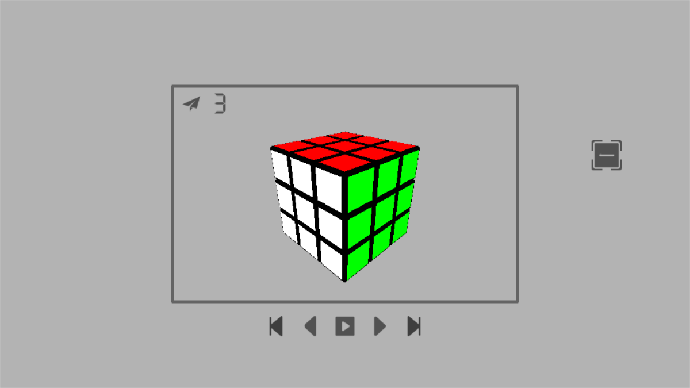
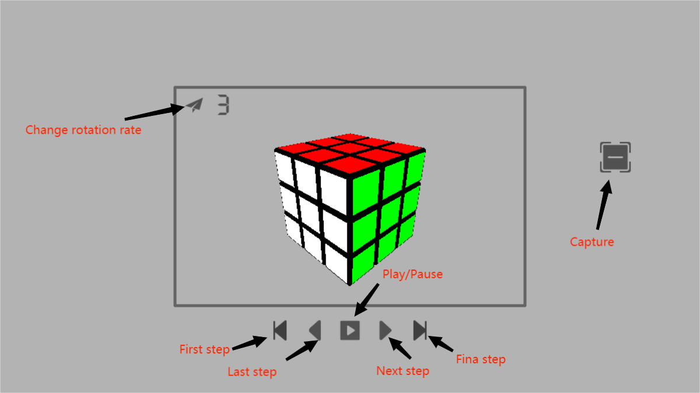